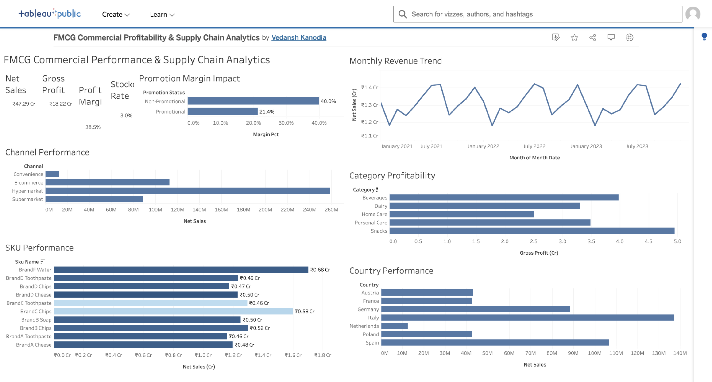

# FMCG Commercial Profitability & Supply Chain Analytics

## Project Overview

An end-to-end FMCG analytics project analyzing commercial profitability, promotional effectiveness, channel performance, geographic performance, SKU contribution, and supply-chain stockouts across three years of synthetic multi-country sales data.

The project combines SQL-based analysis with Tableau visualization to translate transactional sales data into actionable business insights.

---

## Business Objectives

- Evaluate overall revenue and profitability
- Identify high-performing product categories and SKUs
- Analyze channel and country-level performance
- Measure the impact of promotions on profitability
- Analyze stockout patterns and potential revenue exposure
- Identify trends that can support commercial and supply-chain decisions

---

## Dataset

The project uses a synthetic FMCG multi-country sales dataset containing approximately 1.1 million transaction records across 2021–2023.

The dataset includes:

- Date and time attributes
- Country and city
- Sales channel
- SKU, category, subcategory and brand
- Units sold
- List price and discount
- Gross and net sales
- Stock availability
- Lead time
- Supplier
- Purchase cost
- Margin

> **Note:** The dataset is synthetic and is used for portfolio and analytical demonstration purposes.

---

## Tools & Technologies

- SQL
- DuckDB
- Tableau Public
- CSV
- Data Visualization
- Business Analytics

---

## Key Performance Indicators

| KPI | Result |
|---|---:|
| Net Sales | ₹47.29 Cr |
| Gross Profit | ₹18.22 Cr |
| Gross Margin | 38.5% |
| Stockout Rate | ~3.0% |

---

## Key Business Insights

### 1. Promotions reduce profitability

Promotional transactions show substantially lower margins than non-promotional transactions.

The dashboard shows approximately **40.0% margin for non-promotional transactions versus 21.4% for promotional transactions**.

This indicates that discounting can materially reduce profitability and should be evaluated based on incremental profit rather than revenue growth alone.

### 2. Snacks are the strongest profit contributor

Snacks generate the highest gross profit among the major product categories.

This makes Snacks an important contributor to overall profitability and a potential priority for assortment and commercial planning.

### 3. Hypermarket is the dominant channel

Hypermarkets generate the largest share of revenue among the analyzed sales channels.

E-commerce is the second-largest channel, followed by Supermarkets and Convenience.

### 4. Italy and Spain are leading markets

Italy and Spain are the strongest markets by revenue, while the Netherlands represents the smallest market in the dataset.

This highlights geographic differences in commercial performance and potential opportunities for market-level strategy.

### 5. SKU concentration matters

A relatively small group of SKUs contributes significantly to total revenue.

SKU-level analysis can therefore support assortment decisions, commercial prioritization, and product-level performance management.

### 6. Stockouts represent a supply-chain risk

The overall stockout rate is approximately **3.0%**.

Even a relatively small stockout rate can create potential revenue exposure when applied across a large transaction base, making inventory availability an important component of commercial performance.

---

## Analytical Approach

The project follows an end-to-end analytics workflow:

```text
Raw FMCG Data
      ↓
Data Validation
      ↓
SQL / DuckDB Analysis
      ↓
Business Metrics
      ↓
Tableau Visualization
      ↓
Business Insights
      ↓
Recommendations
```

---

## SQL Analysis

The SQL analysis is organized into separate analytical modules:

| File | Analysis |
|---|---|
| `01_data_validation.sql` | Dataset validation and data quality checks |
| `02_category_analysis.sql` | Category-level revenue and profitability |
| `03_channel_analysis.sql` | Sales channel performance |
| `04_country_analysis.sql` | Geographic performance |
| `05_promotion_analysis.sql` | Promotional impact on profitability |
| `06_stockout_analysis.sql` | Stockout patterns and revenue exposure |
| `07_sku_analysis.sql` | SKU-level commercial performance |

---

## Dashboard

The Tableau Public dashboard provides an interactive view of:

- Monthly Revenue Trend
- Promotion Margin Impact
- Channel Performance
- Category Profitability
- SKU Performance
- Country Performance
- Net Sales
- Gross Profit
- Profit Margin
- Stockout Rate

### View Interactive Tableau Dashboard

[**Open the Tableau Public Dashboard →**](https://public.tableau.com/views/FMCGCommercialProfitabilitySupplyChainAnalytics/FMCGCommercialPerformanceDashboard?:language=en-US&:sid=&:redirect=auth&:display_count=n&:origin=viz_share_link)



---

## Business Recommendations

### Promotion Strategy

Evaluate promotions based on incremental profit and margin impact rather than revenue uplift alone.

Promotional activity should be targeted toward products and situations where additional volume can justify the reduction in margin.

### Category Management

Prioritize high-profit categories such as Snacks while continuing to monitor profitability across the broader portfolio.

Category-level profitability can support assortment planning and resource allocation.

### Channel Strategy

Use the strong performance of the Hypermarket channel as an important input for channel planning while evaluating growth opportunities across E-commerce and other channels.

### Geographic Strategy

Investigate the drivers behind stronger performance in Italy and Spain and assess opportunities to improve lower-performing markets.

Market-level analysis can help guide commercial expansion and resource allocation.

### SKU Management

Use SKU-level revenue and profitability analysis to identify high-contributing products and support assortment optimization.

High-performing SKUs can receive greater commercial focus while lower-performing products can be evaluated for pricing, promotion, or assortment changes.

### Inventory Planning

Monitor stockout patterns alongside demand and supplier lead times to reduce potential revenue loss from product unavailability.

Supply-chain performance should be considered alongside commercial performance when making inventory decisions.

---

## Project Structure

```text
fmcg-commercial-profitability-supply-chain-analytics/
│
├── dashboard/
│   ├── .gitkeep
│   └── dashboard_screenshot.png
│
├── insights/
│   └── business_insights.md
│
├── sql/
│   ├── 01_data_validation.sql
│   ├── 02_category_analysis.sql
│   ├── 03_channel_analysis.sql
│   ├── 04_country_analysis.sql
│   ├── 05_promotion_analysis.sql
│   ├── 06_stockout_analysis.sql
│   └── 07_sku_analysis.sql
│
└── README.md
```

---

## Project Outcome

This project demonstrates an end-to-end business analytics workflow covering:

- Data validation
- SQL-based analysis
- Commercial profitability analysis
- Promotion effectiveness
- Channel performance
- Geographic analysis
- SKU performance analysis
- Supply-chain risk analysis
- Business intelligence dashboarding
- Data-driven recommendations

The project demonstrates how transactional FMCG data can be transformed into commercially relevant insights for pricing, promotion, assortment, channel, market, and supply-chain decisions.

---

## Key Skills Demonstrated

### Data & Analytics

- SQL
- Data validation
- KPI development
- Aggregation and segmentation
- Trend analysis
- Profitability analysis

### Business Analysis

- Commercial performance analysis
- Promotion effectiveness
- Channel analysis
- Market analysis
- SKU analysis
- Supply-chain risk analysis

### Visualization

- Tableau Public
- KPI dashboards
- Business dashboards
- Interactive data visualization

---

## Author

**Vedansh Kanodia**

Portfolio project focused on business analytics, commercial strategy, profitability analysis, and data-driven decision-making.
